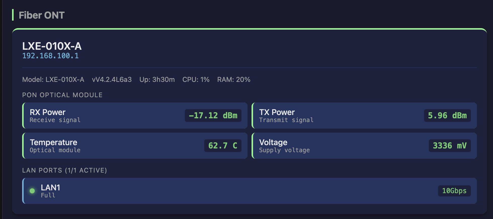

# LEOX status API

A small, read-only HTTP adapter for the LEOX LXE-010X-A web status pages. It
reads `/status.asp`, `/status_pon.asp`, and `/lan_port_status.asp`. When the ONT
session expires, it submits the web login form and retries the read. It does
not change ONT settings.

The adapter can reach the ONT directly, or through an OPNsense HAProxy listener
when the ONT and PPPoE share one Ethernet cable. See [OPNsense setup](docs/opnsense.md)
for the persistent management address, VLAN 835, and restricted proxy listener.

## Run

Requirements: Python 3.12+ or Docker Compose. Copy `.env.example` to `.env` and
set the values for your network. `.env` is ignored by Git; keep it private.

```sh
cp .env.example .env
# Edit .env with your own values, then:
docker compose up -d --build
curl http://127.0.0.1:8085/health
```

Compose publishes on `LEOX_API_BIND_IP:LEOX_API_PORT`, defaulting to
`127.0.0.1:8085`. Set the bind IP to a specific LAN address if another host
needs the API. The API itself has no client authentication, so restrict access
to trusted hosts with your firewall. Do not publish it on the WAN.

For a direct Python run, load the same environment variables and run
`python3 server.py`; it listens on `PORT` (default 8000). `LEOX_TIMEOUT`
sets the upstream request timeout in seconds (default 5) in both modes.

| Variable | Purpose |
| --- | --- |
| `LEOX_BASE_URL` | ONT URL or restricted HAProxy listener, such as `http://<router-lan-ip>:8100` |
| `LEOX_DEVICE_IP` | ONT management IP shown in `/status`, usually `192.168.100.1` |
| `LEOX_USERNAME`, `LEOX_PASSWORD` | ONT web login; needed when its session expires |
| `LEOX_PROXY_TOKEN` | Token required by the HAProxy listener; leave empty only for direct ONT access |
| `LEOX_API_BIND_IP`, `LEOX_API_PORT` | Host address and port for Docker Compose |

The code's default `LEOX_BASE_URL` is an example OPNsense listener at
`http://10.0.0.1:8100`. Set it explicitly for your network.

## Endpoints

Open [http://127.0.0.1:8085/docs](http://127.0.0.1:8085/docs) for interactive
Swagger UI. Its source definition is available as OpenAPI 3.1 JSON at
[http://127.0.0.1:8085/openapi.json](http://127.0.0.1:8085/openapi.json).
`/docs/` redirects to `/docs`, and `/docs/openapi.json` redirects to the
canonical `/openapi.json` URL.
These routes are also available on the configured LAN bind IP and port. `/`
redirects to `/docs`. Swagger UI loads pinned assets from jsDelivr, so the
browser needs internet access to display the page; the JSON definition works
without the CDN.

`/health`, `/pon`, `/device`, `/lan`, `/system/stats`, and `/status` return JSON.
`/status` follows the response shape used by a ZTE dashboard adapter. Missing
or unsupported readings become JSON `null`. Upstream failures and changed HTML
layouts return HTTP 502 with an error message.
JSON API and documentation responses include `Cache-Control: no-store` so
changing readings are not cached.

The `/status` JSON is enough for an agent to create a dashboard with device,
optical, and LAN readings. This screenshot is one example; the dashboard
application is not part of this repository.



The ONT allows one web session per source IP. Clients behind the same HAProxy
server share that session. A second login can displace it; the adapter attempts
to log in again on the next read.

Run the parser and HTTP tests with:

```sh
python3 -m unittest discover -s tests -v
```
